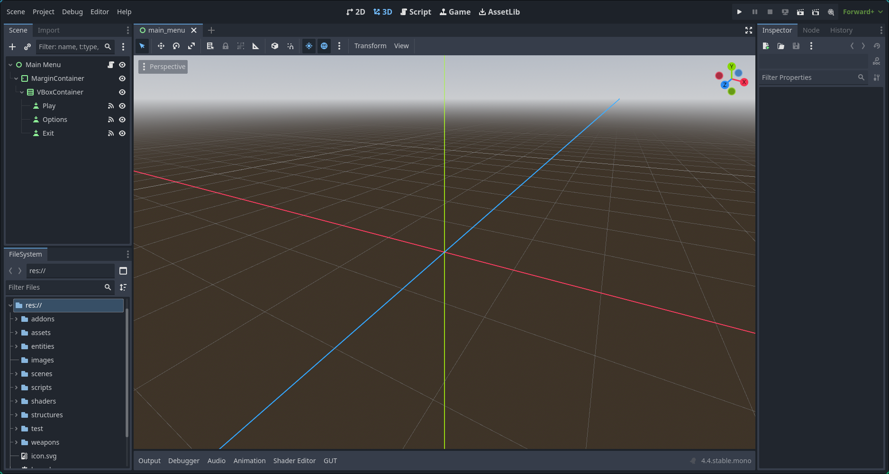
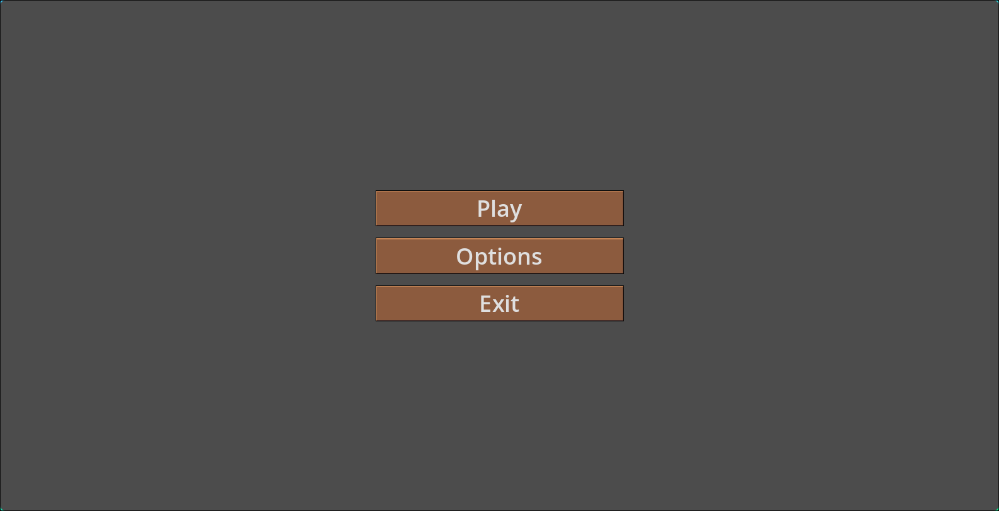
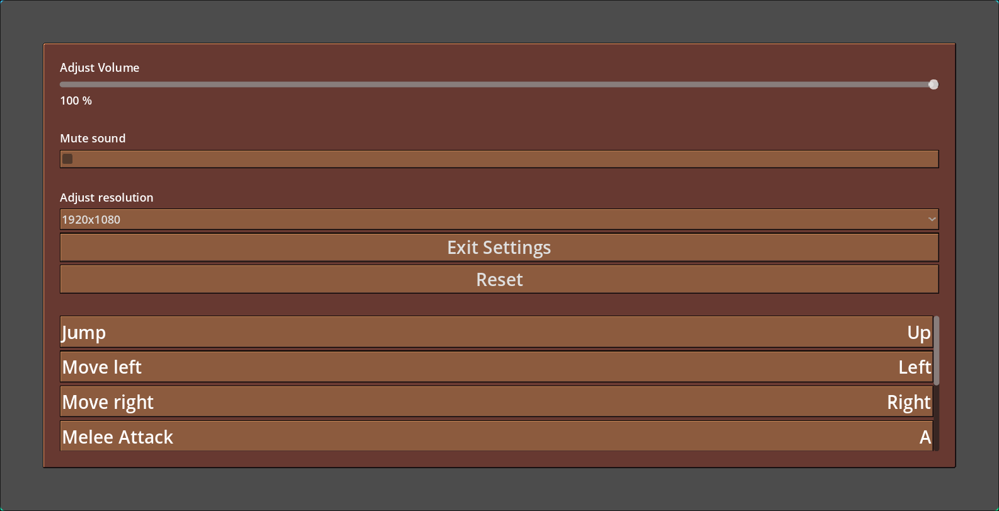
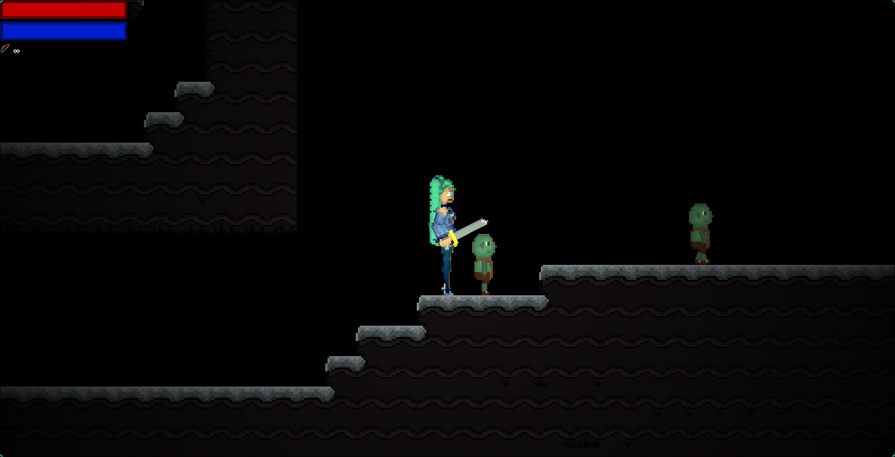
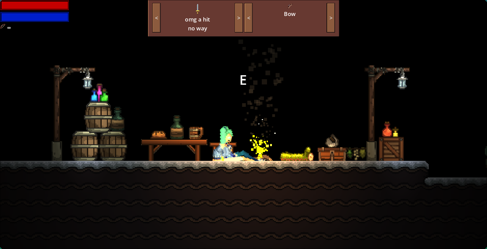
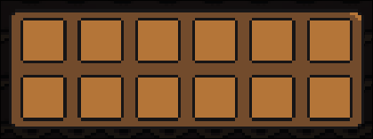
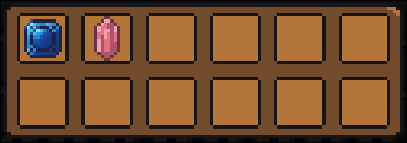
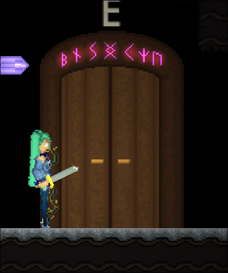

# Naudotojo dokumentacija

## Žaidimo projekto atidarymas

Šis žaidimas naudoja Godot 4.4 variklio versiją, todėl norint jį paleisti turite parsisiūsti šį variklį iš šios nuorodos: [https://github.com/godotengine/godot-builds/releases/download/4.4-stable/Godot_v4.4-stable_mono_linux_x86_64.zip](https://github.com/godotengine/godot-builds/releases/download/4.4-stable/Godot_v4.4-stable_mono_linux_x86_64.zip)

Atidarius šį projektą su Godot varikliu bus matomas šis vaizdas:

Viršutinėje dešinėje ekrano pusėje matomi paleidimo būdai:

Jų reikšmės iš eilės:
* Paleisti projektą
* Pristabdyti projektą
* Sustabdyti projektą
* Nuotolinis paleidimas
* Paleisti dabartinę sceną
* Paleisti tam tikrą sceną
* Filmavimo rėžimas

Norint paleisti žaidimą, reikia spustelti `Paleisti projektą` mygtuką (pirmąjį nuo kairės)

## Žaidimo dokumentacija

### Pagrindinis meniu

Pagrindiniame meniu matome tris pasirinkimus iš eilės: `Pradėti`, `Nustatymai` ir `Išeiti`

### Nustatymai

Nustatymuose matome šias parinktis:
* Garso nustatymas
* Garso užtildymas
* Žaidimo raiškos nustatymas
* Išeiti iš nustatymų
* Atkurti nustatymus (Reset)
* Mygtukų nustatymai

Čia galite pakeisti žaidimo garso efektų garsumą arba juos visai užtildyti. *(Pastaba: žaidime yra tik vienas garso efektas)*

Žaidimo raišką galite reguliuoti tarp triejų parinkčių:
1. 1920x1080
2. 1600x900
3. 1280x720

Šiuo metu galima pamatyti įprastus mygtukų nustatymus ir pakeisti juos šiem veiksmam:
* Pašokti (Jump)
* Judėti kairėn (Move left)
* Judėti dešinėn (Move right)
* Atakuoti (Melee attack)
* Atakuoti su nuotoliu (Ranged attack)
* Pasinaudoti objektu pasaulyje (Interact)
* Pulti (Dash)
* Inventorius (Inventory)

Paspaudus ant tam tikro veiksmo bus rodoma `Press key to bind...`. Tada bus išsaugotas bet kuris klaviatūros paspautas mygtukas tam tikram veiksmui. Atšaukti pakeitimo neįmanoma.

### Žaidimas

Įprastinis atakavimo mygtukas yra `A`, o norint naudotis lanką reikia laikyti `S` mygtuką. 

Norint judėti, naudojamos rodyklės ant klaviatūros, tačiau visi mygtukai gali būti pakeisti nustatymuose. Veržtis į tam tikrą pusę galima paspaudus `D` mygtuką.

Žaidimo tikslas: surasti išėjimą iš šios teritorijos. Šiuo metu nėra būtybių, kurie galėtų sužaloti žaidėją, todėl atakuoti goblinus nėra būtina. 

Suradus laužą, galima prie jo pailsėti paspaudus `E` mygtuką:

Esant netoli ir ilsintis prie laužo, negalima atakuoti, tačiau kai žaidėjas ilsisi galima pakeisti šiuo metu naudojamus ginklus su sąsaja viršuje. *(Pastaba: šiuo metu ginklai skiriasi tik išvaizda ir yra tik vienas lankas)*

Žaidžiant žaidimą, galima taip pat atidaryti inventorių su `I` klavišų pagal numatytuosius nustatymus. Jis atrodo šitaip:

Čia galite pamatyti surinktus daiktus. Žaidimo pasaulyje atsitiktinai generuojasi dviejų rūšių brangakmeniai:
 *(Pastaba: šiuo metu surenkami objektai nėra niekur naudojami)*

Norint pabaigti žaidimą, turite atrasti išėjimo duris ir priėjus prie jų paspausti `E` klavišą. Durys atrodo šitaip:

